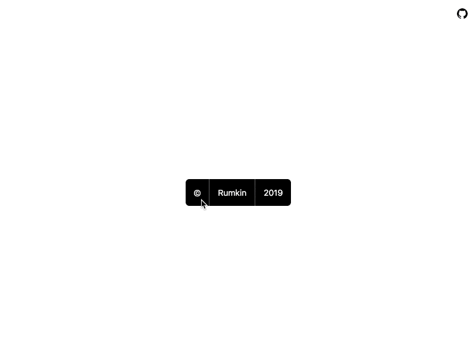

# CopyBar

CopyBar is a component which helps developers to provide information about others' code they use in web applications they create. This should help authors of libraries to advertise own work and receive some value from it.

## Proposal

Convert copyright message like "©, Author, 2019" into group of links or buttons, where:

* "©" refers to about section with app dependencies
* "Author" refers to author's information
* "2019" refers to app's changelog.

### About section

This section contains license information, list of used packages, application name and version.

### Author section

This section doesn't require any particular structure.

### Changelog section

Present valuable information into a web app about its' changes. Should hold list of versions with changes and links to commits.

## Preview

* [Codesandbox preview](https://codesandbox.io/s/interesting-water-srxn7?fontsize=14&view=preview).

## Real life example

You can see it in action at Code-to-Image web app:
* [About](https://code-to-image.now.sh/#copyright).
* [Author](https://code-to-image.now.sh/#author).
* [Changelog](https://code-to-image.now.sh/#changelog).

## License

MIT © [Rumkin](https://rumk.in)
